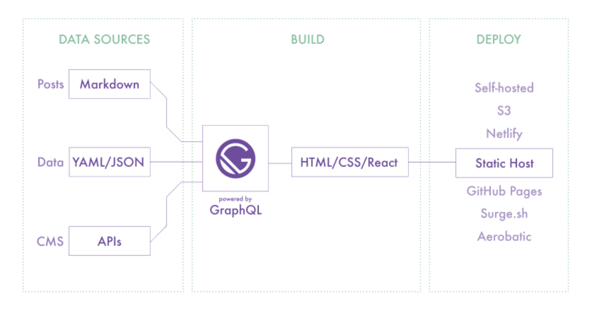

Setting up a blog with static pages was never this easy. [GatsbyJS](https://www.gatsbyjs.org/) is an amazing tool and super simple to learn.

Here are a few features that I absolutely love with this new setup ❤️

## I can show off my coding expertise 😜

```js
// JS Coding Snippet
(function() {

var cache = {};
var form = $('form');
var minified = true;

var dependencies = {};

var treeURL = 'https://api.github.com/repos/PrismJS';
var treePromise = new Promise(function(resolve) {
```

Right now I am writing my blogs as MDX files hosted on Github but in future I might move to [Prismic](https://prismic.io/) as a Headless CMS which I think will be a little complicated to setup but once done
things will become butter smooth.

The integration looks like this 🔭



## It supports Markdown Snippets 📋

```md
# Heading 1

## Heading 2

- List Item 1
- List Item 2
- List Item 3
```

## CSS Snippets too 💅🏻

```css
code[class*='language-'],
pre[class*='language-'] {
  color: black;
  background: none;
  font-family: Consolas, Monaco, 'Andale Mono', 'Ubuntu Mono', monospace;
  text-align: left;
  white-space: pre;
  word-spacing: normal;
  word-break: normal;
}
```

A personal blog was one of the things that I had planned to do this year. I am happy that I set it up.

At first I wasn't certain whether I should use [GatsbyJS](https://www.gatsbyjs.org/) or build something on my own which I've already done for some clients
but after trying out gatsby and considering how good it is, I'm sold that this is probably
the best option for a portfolio/blog/static website/knowledge-center website with dynamic content.

> It took me just a few hours to get this thing to production. It's that simple. 🤪

## Thank you 🎈

`More stuff coming soon...`
